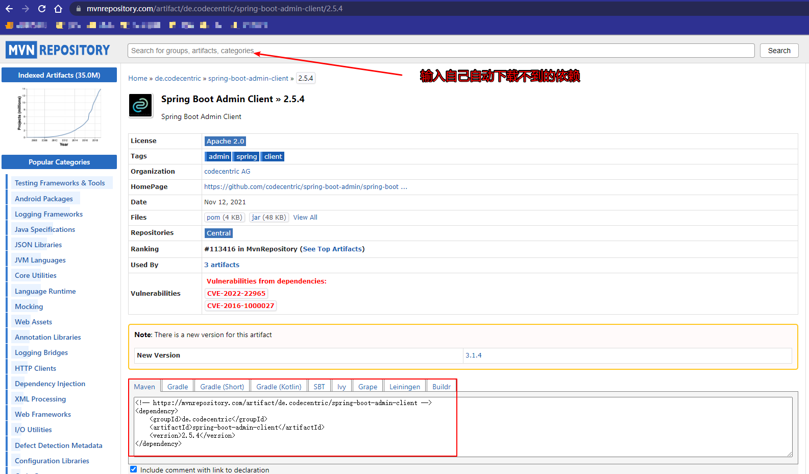
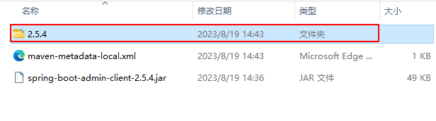

# 手动下载maven依赖

## 1.以SpringBoot 监控客户端为例子

## 2.先去官网寻找合适的版本下载jar包

[中心仓库](https://mvnrepository.com/)




## 3.执行命令，记得加**双引号**，并且保持**在一行**

```
mvn install:install-file 
"-DgroupId=组织名字" 
"-DartifactId=依赖名字" 
"-Dversion=版本信息" 
"-Dpackaging=jar" 
"-Dfile=jar包名字"
```

执行下面的命令，

````
mvn install:install-file "-DgroupId=de.codecentric" "-DartifactId=spring-boot-admin-starter-client" "-Dversion=2.5.4" "-Dpackaging=jar" "-Dfile=spring-boot-admin-client-2.5.4.jar"
````

